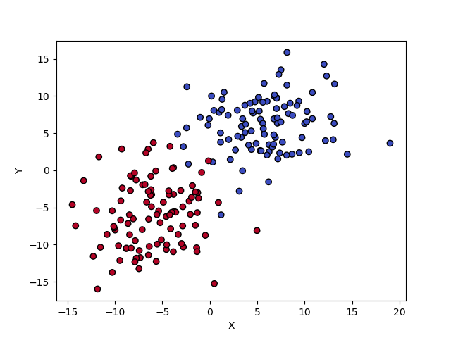
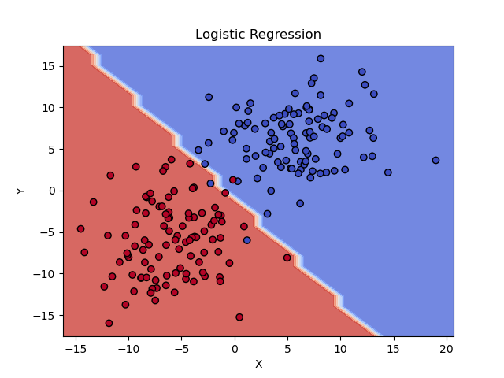

# Logistic Regression Project

Logistic Regression is supervised learning model, which can be used in classification analysis.
This project contains examples of Logistic Regression implementation.

## Used Technologies

Python:
- sklearn
- numpy
- matplotlib
- random

## Classification

Logistic Regression is the Machine Learning method used for binary (2 classes) classification.
In this project the scikit-learn library was used.

In the experiments, the class was as follows: `sklearn.linear_model.LogisticRegression(penalty='l2', solver='newton-cg')`.

### Creating Data

The data was created for one type of experiment: just 2 labels (for binary classification).

Randomly distributed points with (x, y) coordinates were created using the `random.gauss()` function. 

### Experiment

